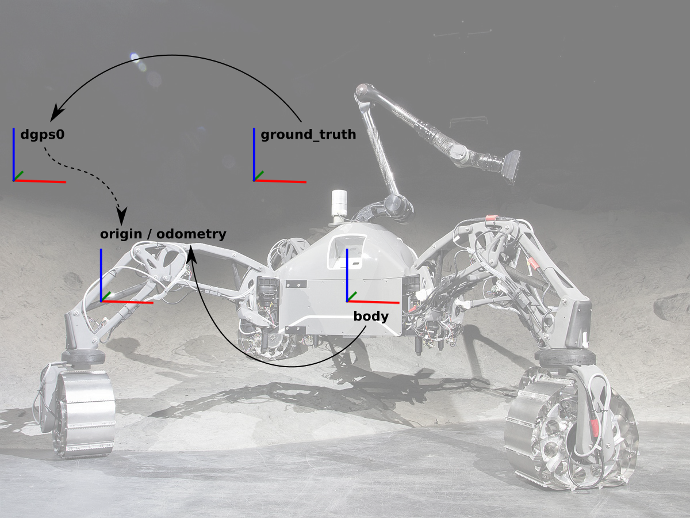

# Morocco Test Campaign

We use the robot
[SherpaTT](https://robotik.dfki-bremen.de/en/research/robot-systems/sherpatt.html)
as a test platform with an attached handheld central rover
unit (HCRU).
The robot is equipped with the following sensors:

* Lidar: Velodyne HDL-32E
* Laser range finder: Hokuyo UST-20LX
* Camera: Basler Ace (2048 x 2048 px, 25 fps)
* IMU: Xsens MTi-28A AHRS
* DGPS capable Inertial Measuring Unit (IMU)
  (as an additional payload)

The HCRU has the following sensor configuration:

* IMU: XSens MTi-10
* B/W camera: Guppy Pro F-125 B
* Color camera: Guppy Pro F-125 C
* Camera lens: Schneider/Kreuznach Cinegon 1.8/4.8

The following image illustrates the frames involved in computing the
GPS position in the local coordinate system. `dgps0` represents
the start position of the robot in the global GPS coordinate system.
the rotation of the robot (frame `origin`) at the beginning in this
global coordinate system is measured with the IMU that is attached to
`origin`. On the other side we can see the current position of the robot
`body` with respect to the start pose `odometry` computed by the
odometry of the SherpaTT. If GPS and odometry where perfect,
`origin` and `odometry` would represent exactly the same frame.
However, we can compare the estimated paths of DGPS and odometry
by assuming that `origin` and `odometry` are identical and plotting
both paths in the same frame.

The following image is a frame diagram of the robot. The shown
frames are used to compare localisation and DGPS ground truth.

